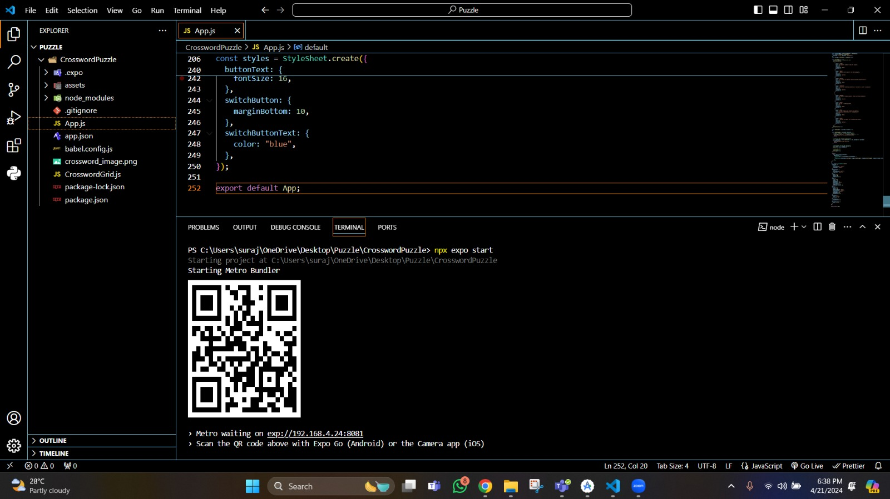

# TECH FOR MOBILE APPLICATIONS

## APP NAME - OSSWO
## TEAM MEMBERS -   
                  1) Suraj Venna
                  2) Zaheer Akmal Shaik
                  3) Chakravarthi Maddi

## Application Overview- 

Our application builds a random crossword puzzle.Each level has four distinct phrases and has 4 buttons to do the functions of the app.

Firstly, we create a folder in our system and named it is puzzle. Now we have opened the vs code and opened this puzzle folder and we click a command to create the react native application with th  name of CrosswordPuzzle.
The command is :
```
npx create-expo-app CrosswordPuzzle
```

To move into the directory of project anc do the coding, click ``` cd CrosswordPuzzle ``` where cd stands for change directory.

Now, to design our app and how it has to look we need app.js which is there in vs code on left side . We need CrosswordGrid.js to define how our puzzlesin the app looks like,So we have to create a file CrosswordGrid.js.

The app. js code and CrosswordGrid.js screenshots in vs code -


Here's a breakdown of the code:

HomeScreen Component: Manages the UI for user authentication, including login and sign-up forms.
App Component: Main component managing the game state, including whether the game has started, crossword data, and user information. Handles user authentication logic.
useState Hook: Used in both components to manage state within functional components.
CrosswordGrid Component: Renders the crossword puzzle grid based on provided data.
User Authentication: Functions handleLogin and handleSignUp validate user input and authenticate users.
Styling: StyleSheet.create defines styles for UI elements.
Exporting Default: App component is exported as the default entry point of the application.


Here's a breakdown of the code:

Component Purpose: CrosswordGrid manages the crossword puzzle interface.
User Input Handling: Manages user input for filling in crossword cells.
Puzzle Generation: Generates a new puzzle grid based on provided data.
Answer Verification: Checks if the user's input matches the correct solution.
Grid Reset: Resets the grid to its initial state.
Puzzle Solving: Reveals the correct solution to the puzzle.
Dynamic Rendering: Renders the grid and clues based on the crossword data provided.

we have update few dependencies in package.json 
so, the package.json looks like this -


Now, we can start to launch and look how our app looks with the update app.js file and CrosswordGrid.js

to start  we can click ```npx expo start```. As our team are having andriod phone we open the expo app and as well as native studio to see how the app is looking.In few seconds of loading we can see the qr code and the commands to open in andriod and othe locations.



As our team is having andrio studio in out systems, we just open google pixle 4 in it and click a to view on andriod. The below screenshots hows the opening of our app


For new users, they can just click on signup and give their name and password and can easily login into the app


Once the user is able to login he can see the game where he/she can solve 4 cross work with indetail questions.


If the user is able to give correcct answer for all his 4 question in the level.he can check his answer by clicking on Verify button.


When the user is not able to solve it he can simply click on solve button to see the solutions. 


So, if user saw the user and wants to solve back the same puzzle he is simply click on Try button which shows the same crossword puzzle removing answers.


Our Teams App demo video - 

https://github.com/shaikzl/TechMobileProject/assets/156874491/90713637-13d2-4458-bc38-475a522babce
